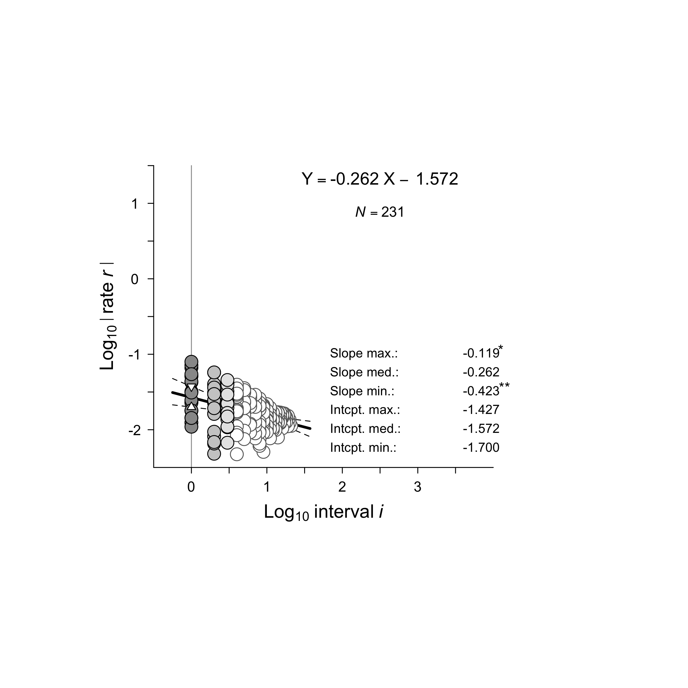
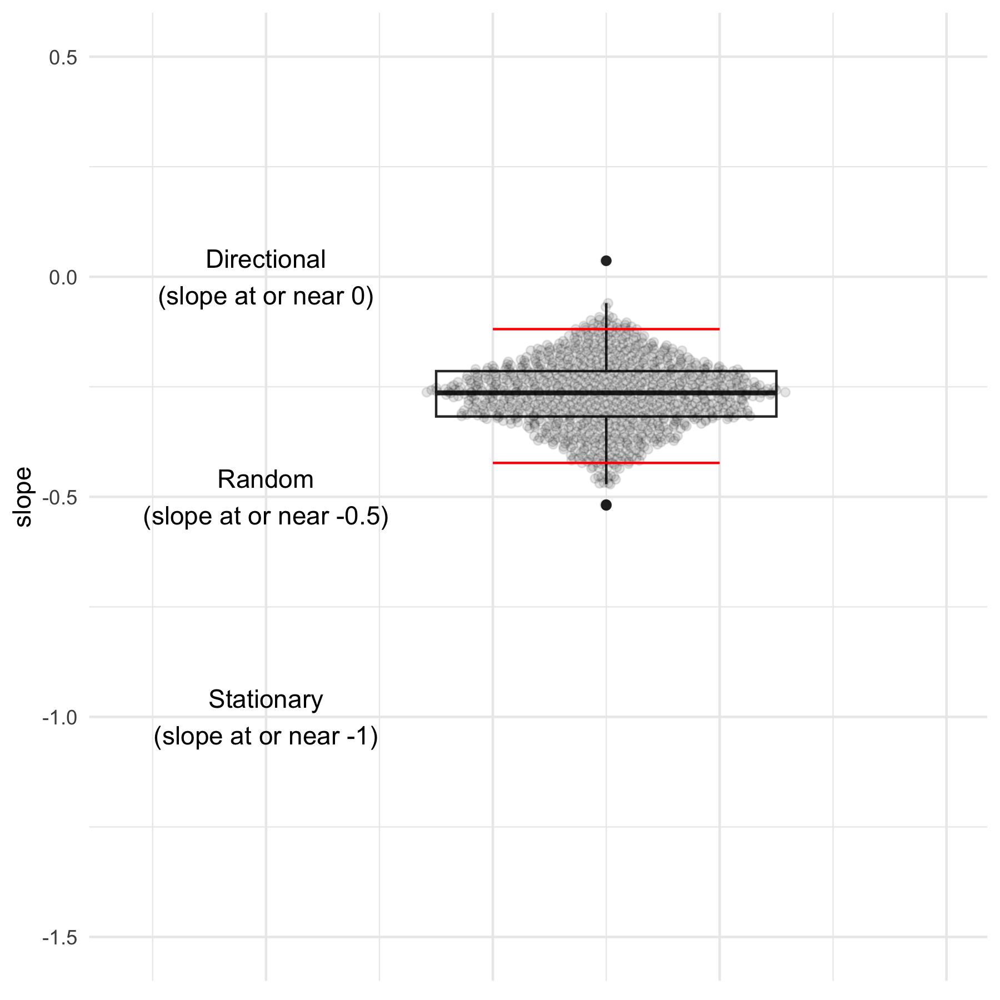
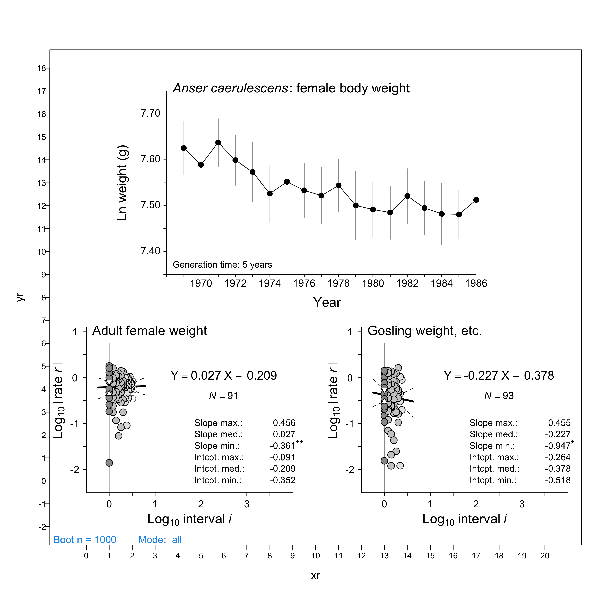
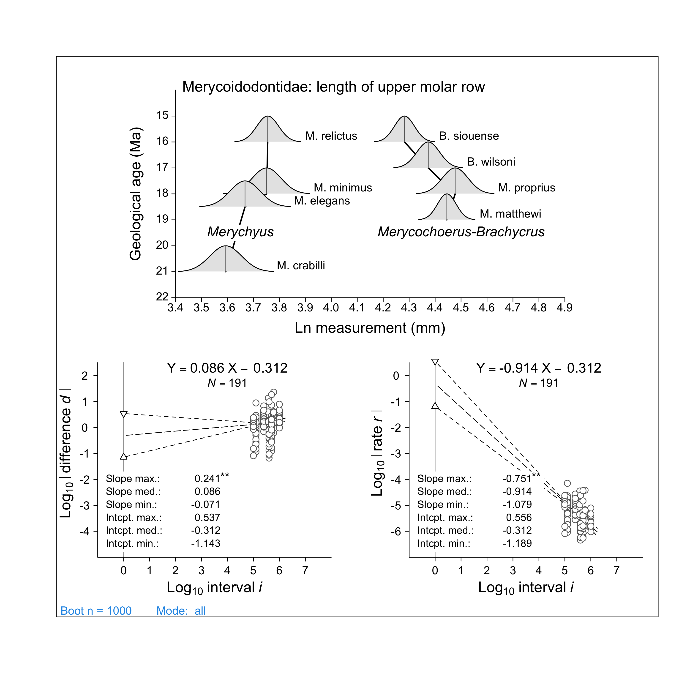

<!-- README.md is generated from README.Rmd. Please edit that file -->

# roev: Rates of Evolution

<!-- badges: start -->

[](https://github.com/benmarwick/roev/actions/workflows/R-CMD-check.yaml)

<!-- badges: end -->

The goal of roev is to provide functions for analysing and visualizing
rates of evolution following the methods in Philip D. Gingerich’s 2019
book *Rates of Evolution: A Quantitative Synthesis*
<https://doi.org/10.1017/9781316711644>. The R code and data files
included here were originally deposited by Gingerich at Dryad
<https://doi.org/10.5061/dryad.1tn7123> and adapted for use by Ben
Marwick.

## Installation

You can install the development version of roev like so:

``` r
if (!require("remotes")) install.packages("remotes")
remotes::install_github("benmarwick/roev")
```

## Simple example

Here is a very simple example based on Gingerich’s case studies. To
compute rates of evolution following Gingerich, we need a data frame
that includes a time variable, a mean variable, a standard deviation
variable, and a number of samples variable. Here’s some example data:

| time |     mean |       sd |   n |
|-----:|---------:|---------:|----:|
|  700 | 3.40e-06 | 9.70e-06 |  29 |
|  720 | 3.30e-06 | 1.17e-05 | 173 |
|  740 | 4.20e-06 | 2.19e-05 | 182 |
|  760 | 4.00e-06 | 1.38e-05 | 197 |
|  780 | 4.50e-06 | 1.58e-05 | 190 |
|  800 | 5.30e-06 | 2.02e-05 | 196 |
|  820 | 7.40e-06 | 3.08e-05 | 239 |
|  840 | 7.40e-06 | 2.93e-05 | 231 |
|  860 | 9.10e-06 | 3.57e-05 | 250 |
|  880 | 6.90e-06 | 2.40e-05 | 219 |
|  900 | 6.30e-06 | 3.29e-05 | 219 |
|  920 | 7.30e-06 | 4.96e-05 | 170 |
|  940 | 6.80e-06 | 2.87e-05 | 177 |
|  960 | 7.40e-06 | 3.26e-05 | 206 |
|  980 | 9.90e-06 | 6.25e-05 | 203 |
| 1000 | 8.80e-06 | 3.02e-05 | 206 |
| 1020 | 1.18e-05 | 5.20e-05 | 302 |
| 1040 | 1.40e-05 | 5.26e-05 | 317 |
| 1060 | 1.41e-05 | 4.85e-05 | 343 |
| 1080 | 1.59e-05 | 6.11e-05 | 331 |
| 1100 | 1.72e-05 | 5.77e-05 | 370 |
| 1120 | 1.64e-05 | 5.65e-05 | 443 |

Next we prepare our data for analysis of rates. It’s important that the
first four columns of our input data are in the order of
time-mean-sd-n. The column names are not important, but it is important
that these are the first four columns in the data frame.

``` r
# first four cols of the input data frame 
# must be time-mean-sd-n, in that order
idrx1 <- roev::DataPrep(x)
```

Now we are ready to plot the Log rate versus log interval (LRI) analysis
of the time series with circles representing rates for corresponding
intervals. This is the distinctive plot in all of Gingerich’s case
studies. It is important because it provides the output of the robust
linear regressions. It’s the slope on these regressions that allows us
to determine if the rate of evolution is random, stationary or
directional. Confidence intervals for the slope and intercept are
computed by bootstrapping, resulting in a stable median and a
representative confidence interval.

``` r

plot(c(-5, 8),   # set up plot 
     c(-5, 8),   # some trial and error required here       
     type = 'n',
     xaxt = 'n',
     yaxt = 'n',
     axes = FALSE,
     ann = FALSE,
     asp = 1)       # aspect ratio (y/x))

bootresultd = roev::TriPanelBC(idrx1,     # idrx matrix
                               "r",       # mode (diff/rate)
                               -3,        # panel placement coordinate x
                               3,         # panel placement coordinate y
                               1000,      # number of bootstrap replications
                               "all",     # 'mode' as "medians","all","mixed"
                               2,         # circle size for points (1.5 or 2)
                               "normal")  # 'equation' position as "normal","lower","none"
```



``` r
# extract some values to use inline in text about the plot

slope_max <- round(bootresultd[[1]][1], 3)
slope_med <- round(bootresultd[[1]][2], 3)
slope_min <- round(bootresultd[[1]][3], 3)
```

In the example above, we see a median slope of -0.264, and a confidence
interval for the slope of -0.423 to -0.119.

Here’s the key to interpreting the LRI plot above (from Gingerich
2019:109)

- **Random** time series have differences that scale with a slope at or
  near 0.500 on a log difference versus log interval or LDI plot. The
  corresponding rates scale with a slope at or near -0.500 on a log rate
  versus log interval or LRI plot.

- **Stationary** time series have differences that scale with a slope at
  or near 0.000 on an LDI plot. The corresponding rates scale with a
  slope at or near -1.000 on an LRI plot.

- **Directional** time series have differences that scale with a slope
  at or near 1.000 on an LDI plot. The corresponding rates scale with a
  slope at or near 0.000 on an LRI plot.

Thus for the example data above, the median slope lies between
expectation for directional change and random change, and is
significantly different from both. The more negative confidence limit
excludes both -1.000 expected for stasis and -0.500 expected for a
random time series, and the more positive limit excludes 0.000 expected
for a directional time series. Thus the time series is interpreted as
directional with a random component (cf. Gingerich 2019:142).

Here’s a plot the summarises the slopes from the above analysis, and
includes some guide to interpreting the output:

``` r
library(ggbeeswarm)
#> Loading required package: ggplot2

ggplot(data.frame(bootresultd[[2]])) +
  aes(0.25, 
      slope) +
  geom_boxplot() +
  geom_quasirandom(alpha = 0.1) +
  annotate("segment",
           y =     slope_max,
           yend =  slope_max,
           x = 0,
           xend = 0.5,
           colour = "red") +
    annotate("segment",
           y =     slope_min,
           yend =  slope_min,
           x =    0,
           xend = 0.5,
           colour = "red") +
    annotate("text",
           x = -0.5,
           y =  0,
           label = "Directional\n(slope at or near 0)") +
    annotate("text",
           x = -0.5,
           y = -0.5,
           label = "Random\n(slope at or near -0.5)") +
    annotate("text",
           x = -0.5,
           y = -1,
           label = "Stationary\n(slope at or near -1)") +
  theme_minimal() +
  theme(axis.ticks.x = element_blank(),
        axis.text.x = element_blank(),
        axis.title.x = element_blank()) +
  scale_x_continuous(limits = c(-0.8, 1)) +
  scale_y_continuous(limits = c(-1.5, 0.5))
```



In the figure above we see the distribution of all slopes from the LRI
plot. The boxplot shows the median slope, the red lines show the minimum
and maximum values for the confidence interval of the slope
distribution. On the left of the panel are text labels to assist with
the interpretation of the slope distribution. In the example above, we
see the distribution of slope values ranges between 0 and -0.5, with the
CI excluding -0.5 (the lower red line is at -0.423) which can be
interpreted as a time series that is directional with a random
component.

## Examples from ‘Rates of Evolution: A Quantitative Synthesis’

Here are a few complete case studies from Gingerich’s book. The code is
almost exactly as he wrote it, taken from the Dryad repository for the
book, I have only slightly simplified the code in a few places. Because
of the distinctive way that Gingerich builds up the final plot with many
different base plot functions, all code has to be in one block to work
correctly in an R Markdown document. His original code and data files
for all the case studies in the book are included here in the `data-raw`
folder.

### Example using a Field Study: Size of Snow Geese at La Pérouse Bay, Manitoba

This is an example showing how to use this package with Gingerich’s R
code for his case study of Size of Snow Geese at La Pérouse Bay,
Manitoba, which is described in section 8.1.12 of ‘Rates of Evolution: A
Quantitative Synthesis’ which is about Phenotypic Change Documented in
Field Studies. Here is Gingerich’s text from this section:

> The snow goose, Anser caerulescens, is a North American species that
> nests in the Canadian Arctic and winters in the southern United States
> and Mexico. Snow geese were studied intensively by Fred Cooke and
> colleagues at La Pérouse Bay, an inlet on Hudson Bay, in northern
> Manitoba (Cooke et al., 1995). In an earlier report from this project,
> Cooch et al. (1991) documented a significant decrease in adult female
> body weight over time, and a parallel decrease in gosling body weight,
> tarsus length, and bill length (the Cooch et al. figures are reprinted
> in Cooke et al., 1995). In the earlier report Cooch et al. attributed
> the decreases in size to overexploitation of food resources at La
> Pérouse Bay, but the decline could also be an evolutionary response to
> global warming or some other environmental change.

> The 17-year decline in the adult female body weight of snow geese
> shown by Cooke et al. (1995) is illustrated in Figure 8.2a. The
> generation time for A. caerulescens is about five years (Niel and
> Lebreton 2005, table 2). Thus the 17-year interval represents a total
> of about 3.4 generations. The Figure 8.2a time series yields a total
> of 91 rates on timescales in the range of a full generation to 3.4
> generations. These have an LRI slope of 0.027 (Figure 8.2b), with a
> 95% confidence interval excluding the slopes of -1.000 and -0.500
> expected for stasis and random change, respectively, affirming Cooke
> et al.’s interpretation of the decline as both directional and
> significant. The time series in Figure 8.2a yields 17 step rates that
> range from h0 = 0.015 to h0 = 0.772 standard deviations per generation
> (median 0.436) on a timescale of one generation.

> The three Cooke et al. (1995) time series for gosling weight, gosling
> tarsus length, and gosling beak length are shorter, spanning 12, 10,
> and 12 years, respectively, equivalent to 2.4, 2.0, and 2.4
> generations. Note that the sample ranges for gosling tarsus length and
> gosling beak length given by Cooke et al. (1995, figures 1b and 1c)
> span +/-1 standard deviation and not +/-1 standard error. Taken
> together the gosling weight, tarsus length, and beak length time
> series yield 93 rates in the range of a full generation to 3.4
> generations. The LRI slope for all together is -0.227, lying between
> expectations for random and directional time series. The 95%
> confidence interval excludes only stasis. Step rates for gosling
> weight, tarsus length, and beak length range from h0 = 0.003 to h0 =
> 1.663 standard deviations per generation (median 0.398) on a timescale
> of one generation.

> Change in the weights of snow goose eggs is also of interest (Cooke et
> al., 1995, p. 223). The time series is not long enough to constrain
> any interpretation of directional change, random change, or stasis,
> but the egg weights yield 13 step rates that range from h0 = 0.008 to
> h0 = 0.493 standard deviations per generation (median 0.222) on a
> timescale of one generation. Median rates for egg weight are lower
> than medians for adult female body weight and for gosling weight,
> tarsus length, and bill length.

Here is his code:

``` r
library(roev)
```

Load the data file

``` r
file1 <-
  "data-raw/Gingerich2019_AnalysisFiles_FieldStudies/8.1.12_Cooke&al1995_Anser_1adultwgt.csv"
file2 <-
  "data-raw/Gingerich2019_AnalysisFiles_FieldStudies/8.1.12_Cooke&al1995_Anser_2goslall.csv"
A <-
  read.csv(
    file1,
    header = TRUE,
    sep = ",",
    quote = "\"",
    dec = ".",
    fill = TRUE
  )
G <-
  read.csv(
    file2,
    header = TRUE,
    sep = ",",
    quote = "\"",
    dec = ".",
    fill = TRUE
  )
```

Preview the data: Adult data

``` r
head(A)
#>   Year Nawgt   Mawgt SEawgt  MaPCI SEaPCI
#> 1 1969     9 2050.25 40.210  1.008  0.502
#> 2 1970    31 1976.49 24.760  0.828  0.277
#> 3 1971    22 2075.05 22.980  1.068  0.139
#> 4 1972    40 1996.94 17.230  0.628  0.265
#> 5 1973    25 1946.15 25.155  0.610  0.323
#> 6 1974    26 1856.15 22.780 -0.423  0.289
```

Preview the data: Gosling data

``` r
head(G)
#>   Year Ngwgt   Mgwgt SEgwgt Ngtar  Mgtar SDgtar Ngbeak Mgbeak SDgbeak
#> 1 1976   171 1409.91 11.260    NA     NA     NA    171 40.782   2.762
#> 2 1977   214 1410.36  9.235    NA     NA     NA    214 41.283   1.601
#> 3 1978   116 1482.43 10.135   116 93.790  4.732    116 41.305   1.624
#> 4 1979   120 1382.43 10.810   120 92.217  2.753    120 40.190   1.813
#> 5 1980   290 1307.66  8.560   290 91.753  1.647    290 40.691   1.012
#> 6 1981   216 1361.26  9.235   216 93.661  2.102    216 41.588   1.181
```

Set up the plotting area, compute the rates, and draw the plot:

``` r

xr <- c(0, 20)
yr <- c(-2, 18)     #xrange;yrange for plot axes
plot(
  xr,
  yr,
  #set up plot
  type = 'n',
  #type 'n' means no plotting
  pin = c(10, 4),
  #plot dimensions x,y in inches
  asp = 1,
  #aspect ratio (y/x)
  col = 1,
  #color black
  las = 1,
  #axis labels always horizontal
  mgp = c(2, .3, 0),
  #margin for axis title/labels/tickline
  tck = -0.01,
  #tick-mark length
  xaxp = c(xr[1], xr[2], xr[1] + xr[2]),
  yaxp = c(yr[1], yr[2], abs(yr[1] - yr[2])),
  #y-axis extreme ticks and number of ticks
  cex.axis = .8,
  cex.lab = 1.1
)           #label size
#dev.size('in')

#======== Plot panel a
xos = 3.5
xoe = 17
yos = 9
yoe = 17            #x,y original start and end
xfs = 0
xfe = 18
yfs = 5
yfe = 5.4           #x,y foreground start and end
xfm = (xoe - xos) / (xfe - xfs)             #x foreground multiplier
yfm = (yoe - yos) / (yfe - yfs)             #y foreground multiplier
lines(c(xos, xoe),
      c(yos, yos),
      lwd = 1,
      lty = 1,
      col = 1)
lines(c(xos, xos),
      c(yos, yoe),
      lwd = 1,
      lty = 1,
      col = 1)

#---------axis labels
for (i in seq(yos, yoe - .5, 1)) {
  lines(c(xos - .12, xos),
        c(i, i),
        lwd = 1,
        lty = 1,
        col = 1)
}
for (i in seq(yos, yoe - .5, 2)) {
  text(
    xos,
    i + 1,
    format(round(.05 * (i - 7) + 7.3, digits = 2), nsmall = 2),
    pos = 2,
    cex = 1,
    col = 1
  )
}
for (i in xos + c(xfs:xfe) * 1 * xfm) {
  lines(c(i, i),
        c(yos, yos - .1),
        lwd = 1,
        lty = 1,
        col = 1)
}
for (i in seq(1970, 1986, 2)) {
  text(
    xos + (i - 1970 + 2) * xfm,
    yos,
    i,
    pos = 1,
    cex = 1,
    col = 1
  )
}
text(
  xos,
  yos + 8.0,
  expression(paste(
    italic('Anser caerulescens') *
      ': female body weight'
  )),
  pos = 4,
  cex = 1.3,
  col = 1
)
text(
  xos - 1.9,
  yos + 4,
  'Ln weight (g)',
  srt = 90,
  cex = 1.3,
  col = 1
)
text(xos + 7, yos - 1.2, 'Year',
     cex = 1.3, col = 1)

#------Adult female weight
LA <- matrix(nrow = nrow(A), ncol = 7)
colnames(LA) = c('Gen', 'Yr', 'N', 'Mean', 'Stdev', 'Ln.M', 'Ln.SD')
for (i in 1:nrow(A)) {
  LA[i, 1] = i                      #Gen
  LA[i, 2] = A[i, 1]                    #Year
  LA[i, 3] = A[i, 2]                    #N
  LA[i, 4] = A[i, 3]                    #Mean
  LA[i, 5] = sqrt(A[i, 2]) * A[i, 4]            #Stdev
  LA[i, 6] = log(LA[i, 4])              #Ln mean
  LA[i, 7] = LA[i, 5] / LA[i, 4]            #Ln stdev
}

#--------Gosling weight
LW <- matrix(nrow = nrow(G), ncol = 7)
colnames(LW) = c('Gen', 'Yr', 'N', 'Mean', 'Stdev', 'Ln.M', 'Ln.SD')
for (i in 1:nrow(G)) {
  LW[i, 1] = i                      #Gen
  LW[i, 2] = G[i, 1]                    #Year
  LW[i, 3] = G[i, 2]                    #N
  LW[i, 4] = G[i, 3]                    #Mean
  LW[i, 5] = sqrt(G[i, 2]) * G[i, 4]            #Stdev
  LW[i, 6] = log(LW[i, 4])              #Ln mean
  LW[i, 7] = LW[i, 5] / LW[i, 4]            #Ln stdev
}

#-----Gosling tarsus length
LT <- matrix(nrow = nrow(G), ncol = 7)
colnames(LT) = c('Gen', 'Yr', 'N', 'Mean', 'Stdev', 'Ln.M', 'Ln.SD')
for (i in 1:nrow(G)) {
  LT[i, 1] = i                      #Gen
  LT[i, 2] = G[i, 1]                    #Year
  LT[i, 3] = G[i, 5]                    #N
  LT[i, 4] = G[i, 6]                    #Mean
  LT[i, 5] = G[i, 7]                    #Stdev
  LT[i, 6] = log(LT[i, 4])              #Ln mean
  LT[i, 7] = LT[i, 5] / LT[i, 4]            #Ln stdev
}

#-------Gosling beak length
LB <- matrix(nrow = nrow(G), ncol = 7)
colnames(LB) = c('Gen', 'Yr', 'N', 'Mean', 'Stdev', 'Ln.M', 'Ln.SD')

for (i in 1:nrow(G)) {
  LB[i, 1] = i                      #Gen
  LB[i, 2] = G[i, 1]                    #Year
  LB[i, 3] = G[i, 8]                    #N
  LB[i, 4] = G[i, 9]                    #Mean
  LB[i, 5] = G[i, 10]                   #Stdev
  LB[i, 6] = log(LB[i, 4])              #Ln mean
  LB[i, 7] = LB[i, 5] / LB[i, 4]            #Ln stdev
}

#--------Plot adult female weights
for (i in 1:nrow(LA)) {
  lines(
    xos + c(LA[i, 1], LA[i, 1]) * xfm,
    20 * c(LA[i, 6] - LA[i, 7], LA[i, 6] + LA[i, 7]) - 138,
    lty = 1,
    lwd = 1,
    col = gray(6 / 10)
  )
}
for (i in 2:nrow(LA)) {
  lines(
    xos + c(LA[i - 1, 1], LA[i, 1]) * xfm,
    20 * c(LA[i - 1, 6], LA[i, 6]) - 138,
    lty = 1,
    lwd = 1,
    col = 1
  )
}
for (i in 1:nrow(LA)) {
  points(
    xos + (LA[i, 1]) * xfm,
    20 * LA[i, 6] - 138,
    pch = 19,
    cex = 1.1,
    col = 1
  )
}

#=== Rate calc: adult female weights
gentime = 5             #generation time fide Niel and Lebreton 2005
rect(3.6, 9.2, 9, 9.6, col = 'white', border = NA)
text(
  3.5,
  9.4,
  "Generation time: 5 years",
  pos = 4,
  cex = .9,
  col = 1
)

n = nrow(LA)
nn = .5 * (n - 1) * n
idr = matrix(nrow = nn, ncol = 9)
colnames(idr) = c('int',
                  'diff.sd',
                  'rate.sd.g',
                  'log.i',
                  'log|d|',
                  'log|r|',
                  'sbn',
                  'wgt',
                  'fgen')       #fgen is fraction of a generation
nc = 0

for (k in 1:(n - 1)) {
  #run length
  for (i in 1:(n - k)) {
    #starting position
    nc = nc + 1
    if (k <= gentime) {
      idr[nc, 1] = 1
    } else {
      idr[nc, 1] = k / gentime
    }   #interval
    meandiff = LA[(i + k), 6] - LA[i, 6]                                    #mean diff.
    poolsd = roev::PoolSD(LA[i + k, 3], LA[i, 3], LA[i + k, 7], LA[i, 7])       #n1,n2,sd1,sd2
    idr[nc, 2] = meandiff / poolsd                                          #diff.sd
    idr[nc, 3] = abs(idr[nc, 2]) / idr[nc, 1]                           #rate.sd.gen
    idr[nc, 4] = log10(idr[nc, 1])                                      #log.i
    idr[nc, 5] = log10(abs(idr[nc, 2]))                                 #log.d
    idr[nc, 6] = log10(idr[nc, 3])                                      #log.r
    if (k == 1) {
      idr[nc, 7] = 1
    } else{
      idr[nc, 7] = 3
    }                       #sbn
    idr[nc, 8] = 1 / idr[nc, 1]                                             #wgt
    idr[nc, 9] = k / gentime                                                    #fract of gen.
  }
}

idrx = idr[!rowSums(!is.finite(idr)), ]  #remove rows that have -Inf
idrxA = idrx[, 1:8]
idrc = idrx[idrx[, 9] >= 1, ]  #keep only rows where interval >= gentime
idrcA = idrc[, 1:8]

#==== Rate calc: gosling weights

idrsum = 0
n = nrow(LW)
nn = .5 * (n - 1) * n
idr = matrix(nrow = nn, ncol = 9)
colnames(idr) = c('int',
                  'diff.sd',
                  'rate.sd.g',
                  'log.i',
                  'log|d|',
                  'log|r|',
                  'sbn',
                  'wgt',
                  'fgen')       #fgen is fraction of a generation
nc = 0

for (k in 1:(n - 1)) {
  #run length
  for (i in 1:(n - k)) {
    #starting position
    nc = nc + 1
    if (k <= gentime) {
      idr[nc, 1] = 1
    } else {
      idr[nc, 1] = k / gentime
    }   #interval
    meandiff = LW[(i + k), 6] - LW[i, 6]                    #mean diff.
    poolsd = roev::PoolSD(LW[i + k, 3], LW[i, 3], LW[i + k, 7], LW[i, 7])   #n1,n2,sd1,sd2
    idr[nc, 2] = meandiff / poolsd                      #diff.sd
    idr[nc, 3] = abs(idr[nc, 2]) / idr[nc, 1]               #rate.sd.gen
    idr[nc, 4] = log10(idr[nc, 1])                  #log.i
    idr[nc, 5] = log10(abs(idr[nc, 2]))                 #log.d
    idr[nc, 6] = log10(idr[nc, 3])                  #log.r
    if (k == 1) {
      idr[nc, 7] = 1
    } else{
      idr[nc, 7] = 3
    }           #sbn
    idr[nc, 8] = 1 / idr[nc, 1]                     #wgt
    idr[nc, 9] = k / gentime                        #fract of gen.
  }
}

idrsum = idrsum + nrow(idr)
idrx = idr[!rowSums(!is.finite(idr)), ]  #remove rows that have -Inf
idrxW = idrx[, 1:8]
idrc = idrx[idrx[, 9] >= 1, ]  #keep only rows where interval >= gentime
idrcW = idrc[, 1:8]

#=== Rate calc: gosling tarsus length
LT = LT[!is.na(LT[, 4]), ]      #remove rows with no mean
n = nrow(LT)
nn = .5 * (n - 1) * n
idr = matrix(nrow = nn, ncol = 9)
colnames(idr) = c('int',
                  'diff.sd',
                  'rate.sd.g',
                  'log.i',
                  'log|d|',
                  'log|r|',
                  'sbn',
                  'wgt',
                  'fgen')       #fgen is fraction of a generation
nc = 0

for (k in 1:(n - 1)) {
  #run length
  for (i in 1:(n - k)) {
    #starting position
    nc = nc + 1
    if (k <= gentime) {
      idr[nc, 1] = 1
    } else {
      idr[nc, 1] = k / gentime
    }   #interval
    meandiff = LT[(i + k), 6] - LT[i, 6]                    #mean diff.
    poolsd = roev::PoolSD(LT[i + k, 3], LT[i, 3], LT[i + k, 7], LT[i, 7])   #n1,n2,sd1,sd2
    idr[nc, 2] = meandiff / poolsd                      #diff.sd
    idr[nc, 3] = abs(idr[nc, 2]) / idr[nc, 1]               #rate.sd.gen
    idr[nc, 4] = log10(idr[nc, 1])                  #log.i
    idr[nc, 5] = log10(abs(idr[nc, 2]))                 #log.d
    idr[nc, 6] = log10(idr[nc, 3])                  #log.r
    if (k == 1) {
      idr[nc, 7] = 1
    } else{
      idr[nc, 7] = 3
    }           #sbn
    idr[nc, 8] = 1 / idr[nc, 1]                     #wgt
    idr[nc, 9] = k / gentime                        #fract of gen.
  }
}

idrsum = idrsum + nrow(idr)
idrx = idr[!rowSums(!is.finite(idr)), ]  #remove rows that have -Inf
idrxT = idrx[, 1:8]
idrc = idrx[idrx[, 9] >= 1, ]  #keep only rows where interval >= gentime
idrcT = idrc[, 1:8]

#=== Rate calc: gosling beak length

n = nrow(LB)
nn = .5 * (n - 1) * n
idr = matrix(nrow = nn, ncol = 9)
colnames(idr) = c('int',
                  'diff.sd',
                  'rate.sd.g',
                  'log.i',
                  'log|d|',
                  'log|r|',
                  'sbn',
                  'wgt',
                  'fgen')       #fgen is fraction of a generation
nc = 0

for (k in 1:(n - 1)) {
  #run length
  for (i in 1:(n - k)) {
    #starting position
    nc = nc + 1
    #idr[nc,1]=k/gentime                        #interval
    if (k <= gentime) {
      idr[nc, 1] = 1
    } else {
      idr[nc, 1] = k / gentime
    }   #interval
    meandiff = LB[(i + k), 6] - LB[i, 6]                #mean diff.
    poolsd = roev::PoolSD(LB[i + k, 3], LB[i, 3], LB[i + k, 7], LB[i, 7])#n1,n2,sd1,sd2
    idr[nc, 2] = meandiff / poolsd                  #diff.sd
    idr[nc, 3] = abs(idr[nc, 2]) / idr[nc, 1]           #rate.sd.gen
    idr[nc, 4] = log10(idr[nc, 1])              #log.i
    idr[nc, 5] = log10(abs(idr[nc, 2]))             #log.d
    idr[nc, 6] = log10(idr[nc, 3])              #log.r
    if (k == 1) {
      idr[nc, 7] = 1
    } else{
      idr[nc, 7] = 3
    }           #sbn
    idr[nc, 8] = 1 / idr[nc, 1]                     #wgt
    idr[nc, 9] = k / gentime                        #fract of gen.
  }
}

idrsum = idrsum + nrow(idr)
idrx = idr[!rowSums(!is.finite(idr)), ]  #remove rows that have -Inf
idrxB = idrx[, 1:8]
idrc = idrx[idrx[, 9] >= 1, ]  #keep only rows where interval >= gentime
idrcB = idrc[, 1:8]

#==== Write gosling file
idrxG = rbind(idrxW, idrxT, idrxB)
idrxG = idrxG[, colnames(idrxG) != "sbn"] # BM added
colnames(idrxG) = c('int',
                    'diff.sd',
                    'rate.sd.g',
                    'log.i',
                    'log|d|',
                    'log|r|',
                    'wgt')

#===== Plot LRI panel b
#assign 'bootn' as boot number
bootn <-
  1000
text(
  -1.7,
  -2.6,
  paste("Boot n =", bootn),
  pos = 4,
  cex = 1,
  col = 4
)
#assign 'mode' as "medians","all","mixed"
mode <- "all"
text(
  2,
  -2.6,
  paste("Mode: ", mode),
  pos = 4,
  cex = 1,
  col = 4
)
#assign circle size for points (1.5 or 2)
psize <- 1.5    #2
#assign 'equation' position as "normal","lower","none" at end of each call
#send (1)idrx matrix, (2)mode(diff/rate), (3)panel placement coordinate x,
#  (4)panel placement coordinate y, (5)bootn, (6)mode, (7)psize, (8)equation
bootresultd = roev::TriPanelBC(idrcA, "r", 1, 4.5, bootn, mode, psize, "lower")
wrlb.d = bootresultd[[1]]
bootmat.d = bootresultd[[2]]


#====== Plot LRI panel c
#send idrx matrix, n, mode(diff/rate), panel placement coordinates, mode
idrcG = rbind(idrcW, idrcT, idrcB)
bootresultr = roev::TriPanelBC(idrcG, "r", 13, 4.5, bootn, mode, psize, "lower")
wrlb.r = bootresultr[[1]]
bootmat.r = bootresultr[[2]]


#==== Label B and C
rect(-.5, 6.7, 21.5, 7.5, border = NA, col = 'white')
rect(.1, 6, 9, 6.7, border = NA, col = 'white')
rect(12.1, 6, 21, 6.7, border = NA, col = 'white')
text(
  0,
  6.5,
  "Adult female weight",
  pos = 4,
  cex = 1.3,
  col = 1
)
text(
  12,
  6.5,
  "Gosling weight, etc.",
  pos = 4,
  cex = 1.3,
  col = 1
)
```



The original caption for this plot in the book is “Size change in the
snow goose Anser caerulescens studied at La Pérouse Bay, Manitoba, from
1969 through 1986 (Cooke et al., 1995). (a) Change in female body weight
is shown through time. Solid circles are means; vertical lines span +/-1
phenotypic standard deviation. Generation time is 5 years. (b) LRI
log-rate-interval plot for 91 rates of change in female body weight
spanning a full generation or longer. Median slope of 0.027 is
consistent with directional change. A bootstrapped 95% confidence
interval for the slope excludes both -0.500 expected for random change
and -1.000 expected for stasis. (c) LRI plot for 93 rates of change in
gosling weight, tarsus length, and beak length spanning a full
generation or longer. Median slope of -0.227 lies between expectations
for directional and random change. The 95% confidence interval excludes
stasis.”

### Example using the Fossil Record: Miocene Merycoidodontidae

This is an example showing how to use this package with Gingerich’s R
code for his case study of *Miocene Merycoidodontidae*, which is
described in section 9.2.5 of ‘Rates of Evolution: A Quantitative
Synthesis’ which is about Phenotypic Change in the Fossil Record. Here
is Gingerich’s text from this section:

> Merycoidodontidae are oreodonts, extinct ruminating pig-like
> artiodactyls that are now extinct. Oreodonts were a major constituent
> of mammalian faunas in North America during the Oligocene and Miocene
> epochs. In 1954 Robert Smith Bader completed a doctoral dissertation
> on variation and evolutionary rates in Miocene oreodonts. In the
> following publication Bader (1955) focused on two common forms: (1)
> smaller and more lightly built Merychyinae including the species of
> the genus Merychyus; and (2) larger and more heavily built
> Merycochoerinae includ- ing species of the genera Merycochoerus and
> Brachycrus.

> Bader (1955) published statistics for 23 measurements of skulls for
> five species of Merychyinae and five species of Merycochoerinae.
> Statistics for one of the measurements, length of the upper molar
> tooth row, are shown graphically in Figure 9.2 to illustrate the
> merycoidodont lineages analyzed here. Each lineage has four species.
> Bader showed each lineage to have a fifth species branching from it,
> but the branching species are closely similar to a contemporaneous
> congener and are omitted here. The geological age for each species
> follows Hilgen et al. (2012, figure 29.9). Generation times of five
> years for Merychyus and eight years for Merycochoerus are estimated
> here (Equation 3.2) from body weights of 41–42 and 275–309 kg,
> respectively, taken from Janis (1990, table 13.4).

> Bader’s measurements yield a total of 191 rates, all nonzero.
> Ninety-seven of these are base rates that range from h5.602 = 1.65 x
> 10^-7 to h5.097 = 7.06 x 10^-5 standard deviations per generation
> (median 5.99 x 10^-6) on timescales of hundreds of thousands of
> generations.

``` r
#====Load file
file1 <- "data-raw/Gingerich2019_AnalysisFiles_FossilStudies/9.2.05_Bader1955_Merycoidodontidae.csv"
B <- read.csv(
  file1,
  header = TRUE,
  sep = ",",
  quote = "\"",
  dec = ".",
  fill = TRUE
)

head(B)
#>               Species MA Line1 Line2 Line3 Line4 X     C1  X.1     C2  X.2
#> 1 Brachycrus siouense 16    NA    NA     5     5 N  16.00   NA  15.00   NA
#> 2                     NA    NA    NA    NA    NA X 231.81 2.50 172.93 2.89
#> 3                     NA    NA    NA    NA    NA V   4.31 0.76   6.47 1.18
#> 4  Brachycrus buwaldi 17    NA    NA     4    NA N     NA   NA     NA   NA
#> 5                     NA    NA    NA    NA    NA X     NA   NA     NA   NA
#> 6                     NA    NA    NA    NA    NA V     NA   NA     NA   NA
#>       C3  X.3    C4  X.4    C5  X.5    C6  X.6    C7  X.7    C8  X.8    C9  X.9
#> 1  18.00   NA 30.00   NA 30.00   NA 30.00   NA 21.00   NA 32.00   NA 34.00   NA
#> 2 126.28 1.94 43.80 0.63 23.83 0.37 54.60 0.62 50.05 0.53 72.38 0.48 34.21 0.37
#> 3   6.53 1.09  7.92 1.02  8.60 1.11  6.47 0.84  4.84 0.75  3.87 0.47  6.23 0.76
#> 4     NA   NA  8.00   NA    NA   NA  5.00   NA  8.00   NA 18.00   NA 18.00   NA
#> 5     NA   NA 50.88 1.60    NA   NA 58.00 1.00 53.50 1.26 75.06 0.73 34.39 0.42
#> 6     NA   NA  8.88 2.22    NA   NA  3.86 1.11  6.64 1.66  4.13 0.69  5.15 0.86
#>     C10 X.10   C11 X.11   C12 X.12   C13 X.13   C14 X.14   C15 X.15   C16 X.16
#> 1 27.00   NA 31.00   NA 33.00   NA 17.00   NA 13.00   NA 13.00   NA 16.00   NA
#> 2 24.41 0.34 12.77 0.11 15.88 0.13 50.35 1.01 79.23 2.04 33.46 0.34 40.00 0.97
#> 3  7.29 0.99  4.78 0.61  4.66 0.57  8.26 1.42  9.30 1.82  3.65 0.72  9.73 1.72
#> 4  7.00   NA 12.00   NA 14.00   NA    NA   NA    NA   NA    NA   NA    NA   NA
#> 5 25.14 0.52 12.86 0.18 16.99 0.25    NA   NA    NA   NA    NA   NA    NA   NA
#> 6  5.45 1.46  4.82 1.39  5.53 1.04    NA   NA    NA   NA    NA   NA    NA   NA
#>     C17 X.17    C18 X.18   C19 X.19   C20 X.20   C21 X.21   C22 X.22   C23 X.23
#> 1 29.00   NA  23.00   NA 29.00   NA 20.00   NA 26.00   NA 24.00   NA 23.00   NA
#> 2 52.21 0.81 202.70 1.50 47.94 0.64 49.85 0.47 76.77 0.63 21.42 0.27 15.60 0.17
#> 3  8.33 1.09   3.55 0.52  7.15 0.94  4.23 0.67  4.21 0.58  6.21 0.90  5.19 0.77
#> 4    NA   NA     NA   NA    NA   NA    NA   NA    NA   NA    NA   NA    NA   NA
#> 5    NA   NA     NA   NA    NA   NA    NA   NA    NA   NA    NA   NA    NA   NA
#> 6    NA   NA     NA   NA    NA   NA    NA   NA    NA   NA    NA   NA    NA   NA
```

``` r
xr <- c(0, 20)
yr <- c(-2, 18)     #xrange;yrange for plot axes
plot(
  xr,
  yr,
  #set up plot
  xaxt = 'n',
  yaxt = 'n',
  xlab = "",
  ylab = "",
  type = 'n',
  #type 'n' means no plotting
  pin = c(10, 4),
  #plot dimensions x,y in inches
  asp = 1,
  #aspect ratio (y/x)
  col = 1,
  #color black
  las = 1,
  #axis labels always horizontal
  mgp = c(2, .3, 0),
  #margin for axis title/labels/tickline
  tck = -0.01,
  #tick-mark length
  xaxp = c(xr[1], xr[2], xr[1] + xr[2]),
  #x-axis ticks, no. ticks
  yaxp = c(yr[1], yr[2], abs(yr[1] - yr[2])),
  #y-axis ticks, no. ticks
  cex.axis = .8,
  cex.lab = 1.1
)           #label size

#======================================================= Plot panel a
xos = 3
xoe = 18
yos = 9.5
yoe = 17.5          #x,y original start and end
xfs = 3.4
xfe = 4.9
yfs = -22
yfe = -15       #x,y foreground start and end
xfm = (xoe - xos) / (xfe - xfs)             #x foreground multiplier
yfm = (yoe - yos) / (yfe - yfs)             #y foreground multiplier
lines(c(xos, xoe),
      c(yos, yos),
      lwd = 1,
      lty = 1,
      col = 1)
lines(c(xos, xos),
      c(yos, yoe),
      lwd = 1,
      lty = 1,
      col = 1)

#--- axis labels
for (i in seq(yos, yoe - .5, 1)) {
  #y-axis
  lines(c(xos - .15, xos),
        c(i, i),
        lwd = 1,
        lty = 1,
        col = 1)
}
for (i in seq(yos, yoe - .5, 1)) {
  text(xos,
       i,
       31.5 - i,
       pos = 2,
       cex = 1,
       col = 1)
}
for (i in xos + 10 * (seq(xfs, xfe, .1) - xfs)) {
  #x-axis
  lines(c(i, i),
        c(yos, yos - .15),
        lwd = 1,
        lty = 1,
        col = 1)
}
for (i in xos + 10 * (seq(xfs, xfe, .1) - xfs)) {
  text(
    i,
    yos,
    format(round(3.1 + .1 * i, digits = 1), nsmall = 1),
    pos = 1,
    cex = 1,
    col = 1
  )
}
text(
  xos,
  yos + 8.0,
  expression(paste(
    'Merycoidodontidae' *
      ': length of upper molar row'
  )),
  pos = 4,
  cex = 1.3,
  col = 1
)
text(
  xos - 1.5,
  yos + 4,
  'Geological age (Ma)',
  srt = 90,
  cex = 1.3,
  col = 1
)
text(xos + 7.5,
     yos - 1.2,
     'Ln measurement (mm)',
     cex = 1.3,
     col = 1)


#--------Add histograms
taxon <- vector(length = 8)         #name vector
taxon[1] = 'B. siouense'
taxon[2] = 'B. wilsoni'
taxon[3] = 'M. proprius'
taxon[4] = 'M. matthewi'
taxon[5] = 'M. relictus'
taxon[6] = 'M. minimus'
taxon[7] = 'M. elegans'
taxon[8] = 'M. crabilli'
UMR <- matrix(nrow = 10, ncol = 4)      #upper molar row matrix
colnames(UMR) = c('age', 'N', 'lnM', 'LnS')
for (i in 1:10) {
  UMR[i, 1] = B[3 * i - 2, 2]
  UMR[i, 2] = B[3 * i - 2, 22]
  UMR[i, 3] = log(B[3 * i - 1, 22])
  UMR[i, 4] = .01 * B[3 * i, 22]
}

UMR = UMR[c(1, 3:7, 9:10), ]    #remove species buwaldi and arenarum
for (i in 5:7) {
  lines(
    xos + 10 * (c(UMR[i, 3], UMR[i + 1, 3]) - xfs),
    yos + 22 - c(UMR[i, 1], UMR[i + 1, 1]),
    lty = 1,
    lwd = 2,
    col = 1
  )
}
for (i in 1:3) {
  lines(
    xos + 10 * (c(UMR[i, 3], UMR[i + 1, 3]) - xfs),
    yos + 22 - c(UMR[i, 1], UMR[i + 1, 1]),
    lty = 1,
    lwd = 2,
    col = 1
  )
}
for (i in 1:8) {
  xbar = xos + 10 * (UMR[i, 3] - xfs)
  stdev = 10 * UMR[i, 4]
  base = yos + 22 - UMR[i, 1]
  hgt = 1
  DrawNorm(xbar, stdev, base, hgt)      #mean,sd,base,hgt
  text(
    xbar + 2.8 * stdev,
    base + .2,
    taxon[i],
    pos = 4,
    cex = 1,
    col = 1
  )
}
rect(4, 11.7, 7, 12.3, col = 'white', border = NA)
text(5.5,
     12,
     'Merychyus',
     font = 3,
     cex = 1.2,
     col = 1)
text(
  14,
  12,
  'Merycochoerus-Brachycrus',
  font = 3,
  cex = 1.2,
  col = 1
)
#======= Calculate rates
LB <- matrix(nrow = 10, ncol = 1 + 3 * 23)
rownames(LB) = c(
  'siouense',
  'buwaldi',
  'wilsoni',
  'proprius',
  'matthewi',
  'relictus',
  'elegans',
  'arenarum',
  'minimus',
  'crabilli'
)
colnames(LB) = c(
  'age',
  'C1N',
  'C1M',
  'C1S',
  'C2N',
  'C2M',
  'C2S',
  'C3N',
  'C3M',
  'C3S',
  'C4N',
  'C4M',
  'C4S',
  'C5N',
  'C5M',
  'C5S',
  'C6N',
  'C6M',
  'C6S',
  'C7N',
  'C7M',
  'C7S',
  'C8N',
  'C8M',
  'C8S',
  'C9N',
  'C9M',
  'C9S',
  'C10N',
  'C10M',
  'C10S',
  'C11N',
  'C11M',
  'C11S',
  'C12N',
  'C12M',
  'C12S',
  'C13N',
  'C13M',
  'C13S',
  'C14N',
  'C14M',
  'C14S',
  'C15N',
  'C15M',
  'C15S',
  'C16N',
  'C16M',
  'C16S',
  'C17N',
  'C17M',
  'C17S',
  'C18N',
  'C18M',
  'C18S',
  'C19N',
  'C19M',
  'C19S',
  'C20N',
  'C20M',
  'C20S',
  'C21N',
  'C21M',
  'C21S',
  'C22N',
  'C22M',
  'C22S',
  'C23N',
  'C23M',
  'C23S'
)

for (r in 1:10) {
  LB[r, 1] = B[3 * r - 2, 2]
  for (c in 1:23) {
    LB[r, 1 + (3 * c - 2)] = B[3 * r - 2, 7 + 2 * c - 1]    #sample size
    LB[r, 1 + (3 * c - 1)] = log(B[3 * r - 1, 7 + 2 * c - 1])   #ln mean
    LB[r, 1 + (3 * c)] = .01 * B[3 * r, 7 + 2 * c - 1]  #stdev
    
  }
}

LB = LB[c(1, 3:7, 9:10), ]              #delete rows: buwaldi, arenarum
LB = LB[nrow(LB):1, ]               #reverse the row order

#------------------------
idr = matrix(nrow = 0, ncol = 9)
colnames(idr) = c('int.g',
                  'diff.sd',
                  'rate.sd.g',
                  'log.i',
                  'log|d|',
                  'log|r|',
                  'sbn',
                  'wgt',
                  'li+lr')
#---------- Merychyus rates
gentime = 5
nr = nrow(LB[1:4, ])                        #number of rows
nn = .5 * (nr - 1) * nr
nc = 0                              #n count
for (col in 1:23) {
  #column number
  for (i in 1:(nr - 1)) {
    #increment
    for (sr in 1:(nr - i)) {
      #start row
      nc = nc + 1
      id <- numeric(length = 9)
      iyr = 1000000 * (LB[sr, 1] - LB[sr + i, 1])       #interval in years
      id[1] = iyr / gentime                 #interval in generations
      meandiff = LB[sr + i, 1 + 3 * col - 1] - LB[sr, 1 + 3 * col - 1]  #mean diff.
      psd = PoolSD(LB[sr, 1 + 3 * col - 2], LB[sr + i, 1 + 3 * col - 2],    #n1,n2,sd1,sd2
                   LB[sr, 1 + 3 * col], LB[sr + i, 1 + 3 * col])
      id[2] = meandiff / psd                #diff.sd
      id[3] = abs(id[2]) / id[1]                #rate.sd.gen
      id[4] = log10(id[1])              #log.i
      id[5] = log10(abs(id[2]))             #log.d
      id[6] = log10(id[3])              #log.r
      if (i == 1) {
        id[7] = 2
      } else{
        id[7] = 3
      }     #sbn
      id[8] = 1 / id[1]                 #wgt
      id[9] = id[4] + id[6]                 #sum
      idr = rbind(idr, id)
    }
  }
}
#---------------------------------------------- Merycochoerus rates
gentime = 8
nr = nrow(LB[5:8, ])                        #number of rows
nn = .5 * (nr - 1) * nr
nc = 0                              #n count
for (col in 1:23) {
  #column number
  for (i in 1:(nr - 1)) {
    #increment
    for (sr in 5:(8 - i)) {
      #start row to run 5 to 8
      nc = nc + 1
      id <- numeric(length = 9)
      iyr = 1000000 * (LB[sr, 1] - LB[sr + i, 1])       #interval in years
      id[1] = iyr / gentime                 #interval in generations
      meandiff = LB[sr + i, 1 + 3 * col - 1] - LB[sr, 1 + 3 * col - 1]  #mean diff.
      psd = PoolSD(LB[sr, 1 + 3 * col - 2], LB[sr + i, 1 + 3 * col - 2],    #n1,n2,sd1,sd2
                   LB[sr, 1 + 3 * col], LB[sr + i, 1 + 3 * col])
      id[2] = meandiff / psd                #diff.sd
      id[3] = abs(id[2]) / id[1]                #rate.sd.gen
      id[4] = log10(id[1])              #log.i
      id[5] = log10(abs(id[2]))             #log.d
      id[6] = log10(id[3])              #log.r
      if (i == 1) {
        id[7] = 2
      } else{
        id[7] = 3
      }     #sbn
      id[8] = 1 / id[1]                 #wgt
      id[9] = id[4] + id[6]                 #sum
      idr = rbind(idr, id)
    }
  }
}
#-----
idrx = idr[!rowSums(!is.finite(idr)), ]  #remove rows that have -Inf


#===================== Plot LRI panel (b)
#assign 'bootn' as boot number
bootn <- 1000
text(
  -1.7,
  -2.6,
  paste("Boot n =", bootn),
  pos = 4,
  cex = 1,
  col = 4
)
#assign 'mode' as "medians","all","mixed"
mode <- "all"
text(
  2,
  -2.6,
  paste("Mode: ", mode),
  pos = 4,
  cex = 1,
  col = 4
)
#assign circle size for points (1.5 or 2)
psize <- 1.2    #1.5/2
#assign 'equation' position as "normal","lower","none" at end of each call
#send (1)idrx matrix, (2)mode(diff/rate), (3)panel placement coordinate x,
#  (4)panel placement coordinate y, (5)bootn, (6)mode, (7)psize, (8)equation
#  (9) vadd or 'vertical addition' to position of points on plot
bootresultd = PalPanelBC(idrx[, 1:8], "d", 1, 4.5, bootn, mode, psize, "normal", 0)

#====== Plot LRI panel (c)

#send idrx matrix, n, mode(diff/rate), panel placement coordinates, mode
bootresultr = PalPanelBC(idrx[, 1:8], "r", 13, 4.5, bootn, mode, psize, "normal", 0)
```



Here is the original caption for this figure from the book: “Rates of
evolution in two Miocene merycoidodont mammal lineages spanning five
million years of geological time. (a) Time-calibrated stratophenetic
graph of species in the lineages analyzed by Bader (1955). Independent
variable, time, is plotted on the vertical or y axis. The base of each
normal curve spans +/-3 standard deviations. (b) Log-difference-interval
LDI plot for 23 measurements showing that differences between species
scale with a slope (0.086) close to that expected for a stationary time
series (0.000). The slope is significantly different from expectation
for both random and directional change. (c) Log-rate-interval LRI plot
shows that rates of change scale with a slope (-0.914) close to that
expected for a stationary time series (-1.000). This slope too is
significantly different from expectations for both random and
directional change. Intercepts in (b) and (c) are the same; both have
wide 95% confidence intervals approaching a span of two orders of
magnitude (open triangles).”

## Code of Conduct

Please note that the roev project is released with a [Contributor Code
of
Conduct](https://contributor-covenant.org/version/2/1/CODE_OF_CONDUCT.html).
By contributing to this project, you agree to abide by its terms.
